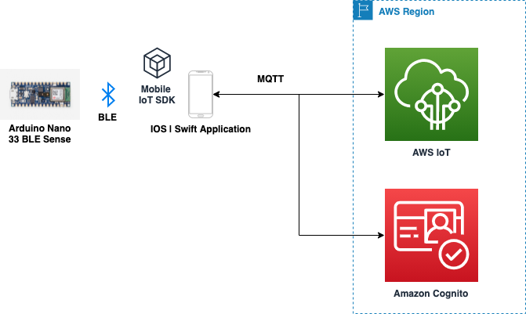
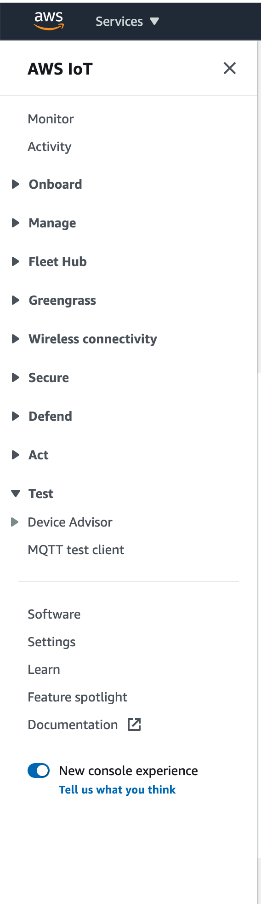
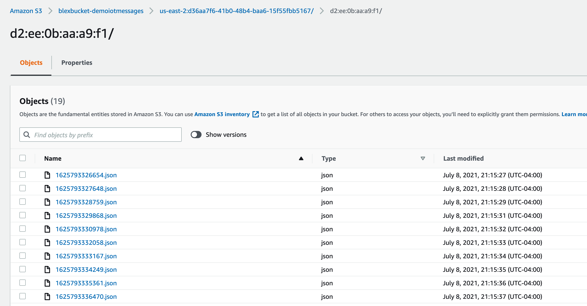

# Bluetooth Low Energy (BLE) IoT Mobile Application with AWS Amplify, AWS IoT, AWS CDK, and Swift

This project provides a working example of how to build a smart, connected device using an [Arduino Nano 33 BLE Sense](https://store.arduino.cc/usa/nano-33-ble-sense) (Nano 33), an iOS applicaiton written in [Swift](https://developer.apple.com/swift/) and AWS IoT. It walks through how to read sensor data from the Arduino Nano using the iOS app and publishing the data using MQTT to AWS IoT. The project is Level 400 tutorial, and demonstrates the following:

1. How to setup backend infrastructure is AWS using [Cloud Development Kit (CDK)](https://aws.amazon.com/cdk/) and use it with [AWS Amplify](https://aws.amazon.com/amplify/) for mobile app development.
2. How to use [Amazon Cognito](https://aws.amazon.com/cognito/) and AWS Amplify for iOS to provide authenticated user login (using [Amazon Cognito User Pools](https://docs.aws.amazon.com/cognito/latest/developerguide/cognito-user-identity-pools.html))
3. How to use [Amazon Cognito Identity Pools](https://docs.aws.amazon.com/cognito/latest/developerguide/cognito-user-identity-pools.html) to grant granular permissions to AWS services the user and the mobile application.
4. How to configure permissions for a specific user using [AWS IoT Policy](https://docs.aws.amazon.com/iot/latest/developerguide/iot-policies.html)
5. How to use AWS Amplify to connect and publish data to AWS IoT Core
6. The tutorial also demonstrates how to publish control commands on an MQTT topic to control the start/stop of data being streamed from the Arduino BLE Nano device.



## Outcome

The Nano 33 has multiple sensors, and upon connecting to the iPhone application it will read the sensors at regular intervals and send them to the iPhone application over BLE. The iPhone/Swift application then reformats the data and publishes it AWS IoT Core using MQTT. The CDK stack additionally sets up AWS IoT Rules and Actions to store the messages from the Arduino in a S3 bucket.

## Prerequisites

This tutorial requires the reader to be familiar with programming in Arduino, iOS/Swift and setting up infrastructure in AWS. In theory, the reader can follow steps to replicate the entire application without having to understand the prerequisites.

### What do you need to follow and build the project

- AWS Account (if you do not have one - you can follow these instructions [here](https://aws.amazon.com/premiumsupport/knowledge-center/create-and-activate-aws-account/))
- Install AWS CDK and tools required for using CDK [AWS CDK Prequisites](https://docs.aws.amazon.com/cdk/latest/guide/work-with.html#work-with-prerequisites). This project was using CDK version 1.105.0 (build 4813992). It is important that CDK core and all packages installed are at the same version. Higher versions should be compatible with the codebase.
- [AWS Amplify](https://docs.amplify.aws/start/getting-started/installation/q/integration/ios) for iOS tooling and [Cocoapods](https://cocoapods.org/) need to be installed.
- [Xcode](https://developer.apple.com/xcode/) is a requirement. You will also need an iPhone to test teh application since the Bluetooth functionality is not available on the Xcode Simulator.
- Install Arduino IDE, this project was developed with Version 1.8.13 - lower versions may work, higher versions of Arduino IDE should certainly work as well. Get the [Arduino IDE](https://www.arduino.cc/en/software).

## Design & System Overview

There are three sections to this project:

1. Setting up and programming the Nano 33 [Overview below, detailed instructions [here](./docs/ArduinoNano.md)].
2. Deploying the AWS resources using AWS CDK
3. Programming the iOS/Swift App [Overview below, detailed instructions [here](./docs/IOSSwiftApp.md)].

### Setting up Arduino and programming Nano 33 BLE Sense

You can find the detailed instructions on how to setup, program the Arduino Nano 33 [here](./docs/ArduinoNano.md).

#### GATT & BLE

The Generic Attribute Profile (GATT) establishes in detail how to exchange all profile and user data over a BLE connection. If you are interested in reading more take a look at this [GATT Services & Characterstics](./docs/GATT.md).

#### Service & Characterstics 

Take a look at the [constants.h](./nanoblesense/constants.h) to see the name of the device used, the UUIDs for the Service, and the receive and transmit characterstics UUIDs created to support the sensor data transfer.

Any changes to this file will need to be updated the constants file in the iOS/Swift source code. See this [BLECharacterstics.swift](./BLEX/BLEX/BLECharacterstics.swift)

### Setup the backend resources using AWS Cloud Development Kit (CDK)

- Change to the `blexstack` folder. 
- Before you can deploy the stack - open the stack file `blexstack-stack.ts` file and search for `bucketName: "blexbucket-demoiotmessages"`. S3 bucket names need to be globally unique - you have two choices. Change the name of the bucket to creat or comment the line out and `cdk` will create a unique name for you.
- Additionally if you have reviewed how to setup `cdk` - and this is first time you are deploying to your region-account you would have to run the `cdk bootstrap` command.
- Install the npm packages and deploy the stack :

```bash
cd blexstack
npm install
cdk deploy
```

Depending on your setup you may have to provide the AWS profile name to the deploy command:

```bash
cdk deploy --profile <profile-name>
```

Successfully building the stack will result in the following output specific to your account and region (for this particular output the region was us-east-2, this will different depending on where the region you deploy the stack to.)

```bash
Outputs:
BlexstackStack.AwsCognitoPoolId = us-east-2:xxxxxxxx-yyyy-zzzz-xxxx-zzzzzzzzzzzz
BlexstackStack.AwsCognitoRegion = us-east-2
BlexstackStack.AwsIoTPolicy = blexMobileAppIoTPermissionsPolicy
BlexstackStack.AwsProjectRegion = us-east-2
BlexstackStack.AwsUserPoolClientID = 5a5afaabck6272shbi94khos4o
BlexstackStack.AwsUserPoolId = us-east-7_APy8g1Fo4

Stack ARN:
arn:aws:cloudformation:us-east-2:<account-no>:stack/BlexstackStack/b123b123-abcd-1111-8888-023327bb688e
```

Make note of all the values - these resources will be provided to the AWS Amplify libraries in the iOS/Swift project.

In addition the parameters output above - the iOS/Swift project will also need the IOT Endpoint for your account and region, you can get that by running the follow aws-cli command:

```bash
aws iot describe-endpoint

```

You will get output similar to below. Copy the equivalent output to "abcdabcdabcdab" and use it for the providing the endpoint address in the iOS/Swift project.

```bash
"endpointAddress": "abcdabcdabcdab.iot.us-east-2.amazonaws.com"
```

The CDK stack uses the default passwork policy for users. Ensure that the password you use to setup the user has minimum 8 characters, special character, numbers, uppercase and lowercase letters.

### Swift/iOS App

For the AWS Amplify support in iOS app we will use the resources created by AWS CDK in the previous step. We will create a file called as amplifyconfiguration.json and populate it with the right values. We use CocoaPods to set up the AWS Mobile SDK for iOS dependencies.

Follow the detailed steps [iOS/Swift App](./docs/IOSSwiftApp.md)

Once you have the app up and running on the iPhone return back.

## Ingest Data to AWS IoT Data Core

To the see data being published to AWS IoT Core, log on to the AWS Console and select the region the stack was deployed in. Select the ‘IoT Core’ service and then down at the bottom of the menu on the left in the ‘Test’ section – click ‘MQTT Test Client’.




Use the “Subscribe” section to subscribe to two topics:

- 'blex’ – this the topic that the iOS/Swift App is publishing the data to.
- An IoT Action & Rule has been setup to read from the ‘blex’ topic and republish to ‘data/${clientid()}’. The rule publishes back to a topic with data/<CognitoID> associated with the user. Subscribe to another topic using this pattern – ‘data/+’  


You can also navigate to S3 service, and select the bucket created by the CDK stack to see the packets being stored in S3 by the second IoT Action & Rule. The rule uses a key pattern that stores the packets in the following format CognitoID/BLEMACAddress/packet.json file.



## Cleaning up AWS Resources

To avoid incurring charges on the AWS resources - you should destroy the CDK stack. This stack is a destroy removal policy so it should clean all resources including the S3 bucket even if it has data in it.

```bash
cd blexstack
cdk destroy
```
## To do and known issues

1. Make the iOS/Swift user interface compatible with different iPhone screen sizes. The current version has been tested on iPhone 12 Pro Max. The storyboard has been created to accomodate different iPhone sizes but has not been physically tested on them.

2. Add error message during sign up specially if the user does not use a password with the default policy of minimum 8 characters, special character, number, lowercase and uppercase letters.

3. Enhance the user interface to display the data coming from the Arduino sensors. Currently the data can be see in the iOS debugger but there is no visualization of the data in the app. Sensor data is printed on the Arduino serial monitor or is visible in the MQTT Test Client in the AWS IoT core console.

## Warning

Before you distribute the CDK stack or the CloudFormation template to your organization, review the template. The CDK stack has been provided to a proof of concept application. Check IAM permissions, deletion policies, update stack behavior, other aspects of the template, and ensure that they are as per your expectations and processes. These sample CDK templates may need updates before you can use them in production. Running these templates may result in charges to your AWS account. Provisioning the supplied Products through ServiceCatalog will create AWS Services which will be billed to your account.

## Security

See [CONTRIBUTING](CONTRIBUTING.md#security-issue-notifications) for more information.

## License

This library is licensed under the MIT-0 License. See the LICENSE file.
