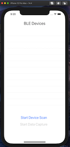

# Setting and programming the iOS/Swift app

## Steps

### Install all the AWS libraries and SDKs

Change the directory to the iOS/App, and open the project in XCode. 
You will have to install all the required pods for the project.

```bash
cd BLEX
pod install
```

The output of the second command would look similar to the following:

```bash

Analyzing dependencies
Downloading dependencies
Installing AWSAuthCore (2.24.2)
Installing AWSCognitoIdentityProvider (2.24.2)
Installing AWSCognitoIdentityProviderASF (2.24.2)
Installing AWSCore (2.24.2)
Installing AWSIoT (2.24.2)
Installing AWSMobileClient (2.24.2)
Installing AWSPluginsCore (1.12.0)
Installing Amplify (1.12.0)
Installing AmplifyPlugins (1.12.0)
Generating Pods project
Integrating client project

[!] Please close any current Xcode sessions and use `BLEX.xcworkspace` for this project from now on.
Pod installation complete! There are 5 dependencies from the Podfile and 9 total pods installed.

[!] Automatically assigning platform `iOS` with version `13.0` on target `BLEX` because no platform was specified. Please specify a platform for this target in your Podfile. See `https://guides.cocoapods.org/syntax/podfile.html#platform`.

[!] The `BLEXUITests [Debug]` target overrides the `ALWAYS_EMBED_SWIFT_STANDARD_LIBRARIES` build setting defined in `Pods/Target Support Files/Pods-BLEX-BLEXUITests/Pods-BLEX-BLEXUITests.debug.xcconfig'. This can lead to problems with the CocoaPods installation
    - Use the `$(inherited)` flag, or
    - Remove the build settings from the target.

[!] The `BLEXUITests [Release]` target overrides the `ALWAYS_EMBED_SWIFT_STANDARD_LIBRARIES` build setting defined in `Pods/Target Support Files/Pods-BLEX-BLEXUITests/Pods-BLEX-BLEXUITests.release.xcconfig'. This can lead to problems with the CocoaPods installation
    - Use the `$(inherited)` flag, or
    - Remove the build settings from the target.

[!] Amplify has added 2 script phases. Please inspect before executing a build. See `https://guides.cocoapods.org/syntax/podspec.html#script_phases` for more information.
```

### Set up files for AWS Amplify configuration and IoT Endpoints

After installing the pods, change into the BLEX subdirectory and copy the files for configuration:

```bash
cd BLEX
cp EmptyConstants.swift Constants.swift
cp emptyamplifyconfiguration.json amplifyconfiguration.json

```

### Open the app in Xcode and fill in the configuration files

Now you can open the Xcode project using the xcworkspace file, but first you will have to go back to the parent directory:

```bash
cd ..
open BLEX.xcworkspace
```

Edit the Constants.swift and amplifyconfiguration.json files to fill in with the values from the CDK deploy output in the previous section.

### Build & test with iOS Simulator

Once you are done with all of the steps above, build the project either using the menu or the Cmd+B key combo. Ignore the warnings, you should be able to build the project with no errors.

To test if access to AWS resources is working, we can first run the application in the iOS simulator. 

Select the “BLEX > iPhone Pro Max 12” and then click on the play icon on the left to start running the app in the iOS Simulator.


On successful startup of the app, you should see the following screen:


Start with setting up a user. Touch the “Sign Up” button on the Simulator using your mouse. On the sign-up screen, enter a Name, User Name, Password and a valid email address.

**Note:** The CDK stack setups default policy for password requirements. When choosing a password use minimum of 8 characters, special character, number, lowercase and uppercase letters. The current version of the app does not provide clarity on the error when the password does not meet the requirements. 


When you click on “Create Account” – it will be followed with a prompt pop-up to enter the confirmation code send to your email. Check your email, and enter the code and click ok.


To test the BLE functionality you will need to use an iPhone. Connect your iPhone to Mac/Xcode and then build, download the app on your iPhone. When the app launches on the iPhone login using the username and password created earlier.

**Note:** All testing is done on iPhone 12 Max Pro. The current version of the code supports only larger screen models. The user interface needs to be updated to accomodate iPhone with different screen sizes.

First you have to scan, and connect to the Arduino Nano. To do so, click on “Start Device Scan”, the app will detect all BLE devices in range and present a list.



Select ‘nanosense’ from this list. Selecting the Nano device will start the discovery of BLE services and characteristics supported. Upon finishing the discovery – the “Start Data Capture” will become ungrayed and touchable.


Note: The iOS/Swift app after the first-time login of a user – also makes a call to attach the IoT Policy to the Cognito ID for the user. The IAM role assumed by the authenticated user has been granted permission to perform this operation. In production systems, the iOS/Swift application should use an authorized API Gateway and Lambda function to attach the Cognito ID to the Policy.

Return to the [Test Data Ingestion section](../README.md#-#-Ingest-Data-to-AWS-IoT-Data-Core)