# Setup and program Arduino Nano 33 BLE Sense

1. We will start with installing the Arduino IDE – go to this [link](https://www.arduino.cc/en/software), and follow the instructions for your OS. 
2. The code for the Arduino Nano 33 is in the ‘nanoblesense’ folder. Open the file nanoblesense.ino in the Arduino IDE. 
3. Connect the Nano 33 using a microusb cable to your machine.
4. You will have to install the board package for the Arduino Nano 33.
  * Select ‘Tools’, click ‘Board:’ and then ‘Boards Manager’ as shown in the image below.

  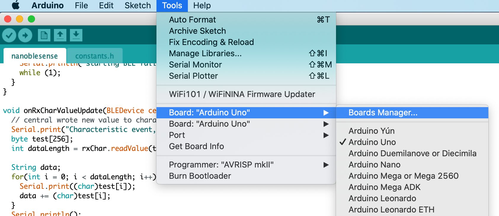

  * Search for ‘Arduino Mbed OS Nano Boards’ and install it. After installation has finished, close the ‘Boards Manager’ window.

  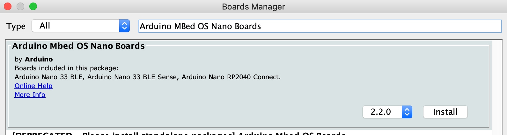

c.	After installing the board packets - select the ‘Arduino Nano 33 BLE’ as shown in the image below.

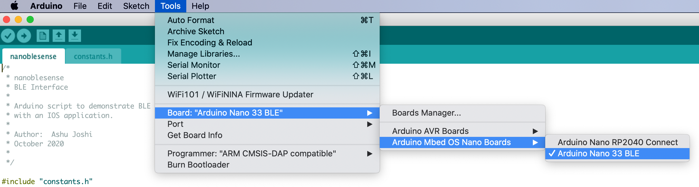

d.	Select the port that is connected to the Nano over the microusb cable as shown in this image below.

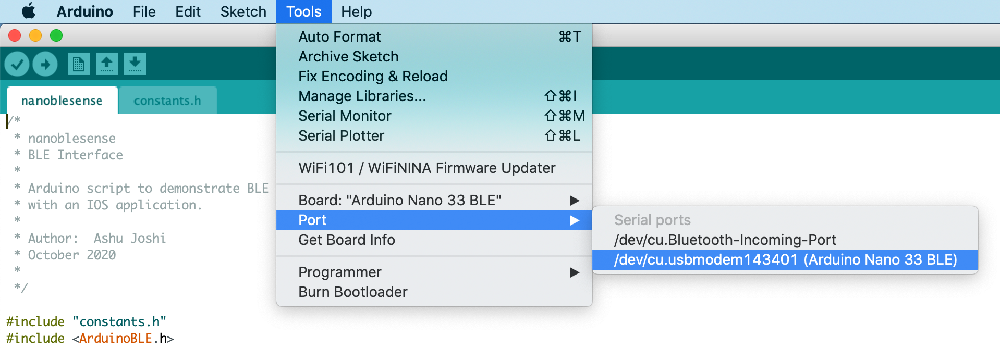

5.	You will have to install libraries for Arduino BLE, all the Nano 33 sensors – temperature, humidity, gyroscope, accelerometer, pressure etc. and JSON. 
  * Select ‘Tools’ in the Menu, followed by ‘Manage Libraries…’

  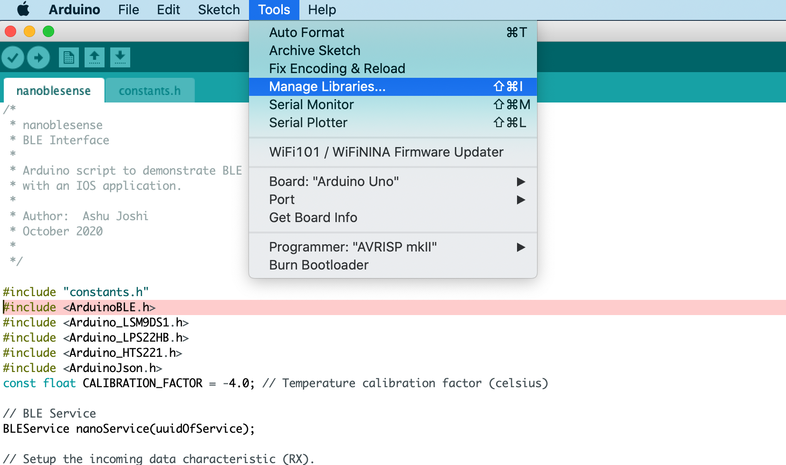

  * Type in ‘ArduinoBLE’ in search box on the right, and then install it as shown in the image. Select the row in the search results and click ‘Install’.

  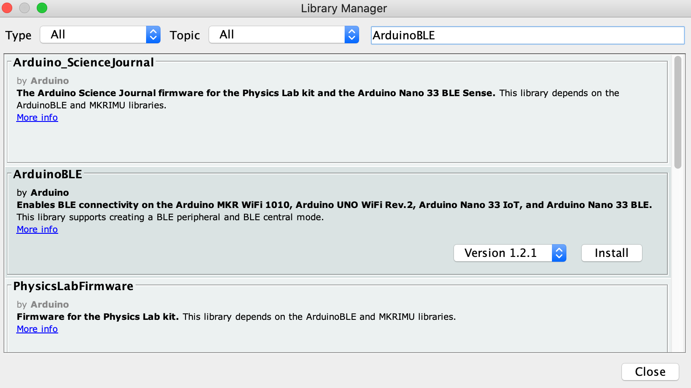

  * Repeat the step above to install the following libraries: ‘Arduino_LSM9DS1’, ‘Arduino_LPS22HB’, ‘Arduino_HTS221’, and ‘ArduinoJson’.

  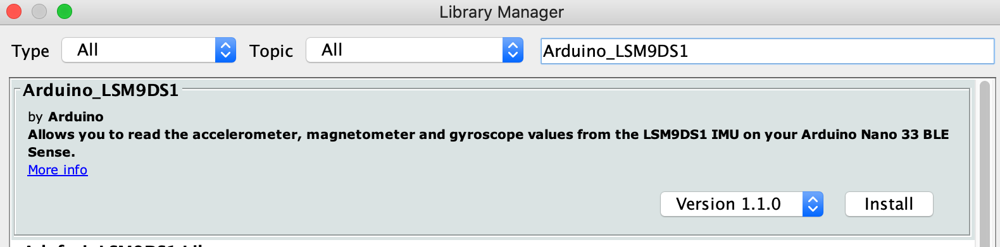

  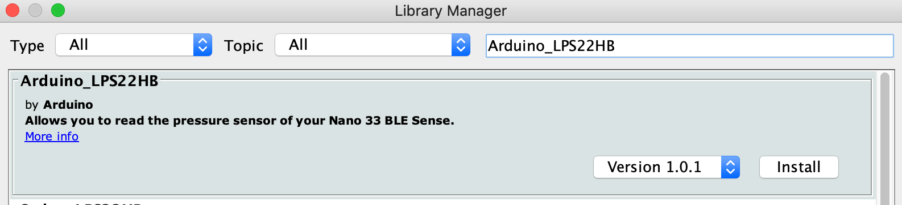

  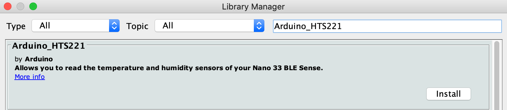

  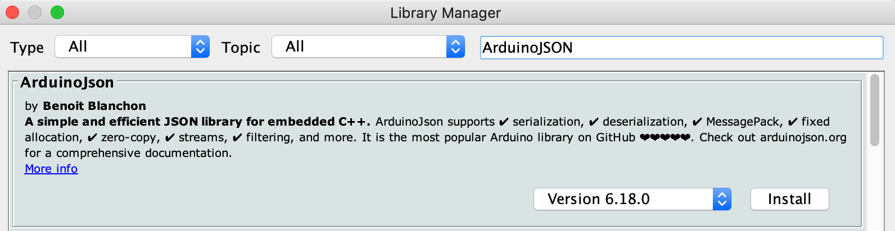

  * Close the Library Manager pop up.
6.	Now you are ready to compile and upload the program to the Nano. If you are on a Mac you can use the shortcut key CMD+U or in the menu bar go to ‘Sketch’ and then select 'Upload'. You may see some warning while compiling you can ignore all of them. In some cases the Arduino IDE may complain that it cannot find the device connected to the Serial Port. You can overcome this by trying again.
7. The Arduino should be running the code now and waiting to connect to the iOS/Swift applicaiton.

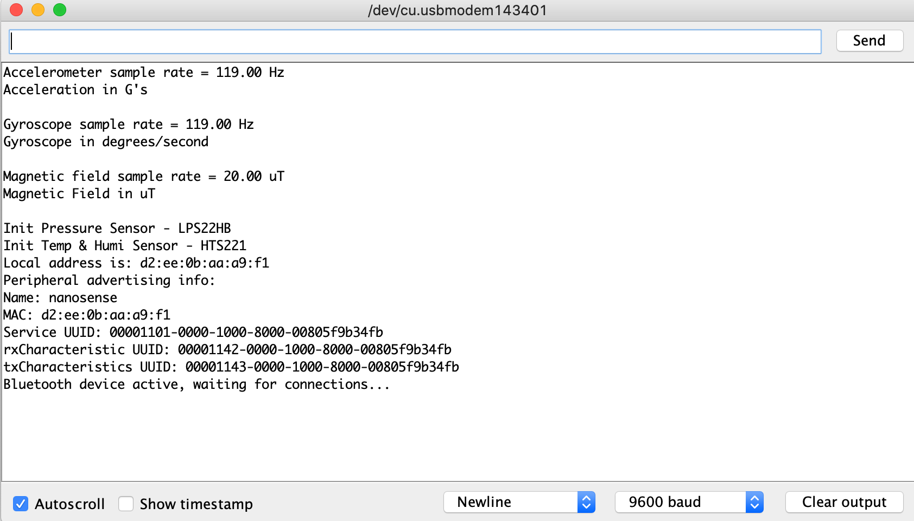

8. Once the iPhone application discovers and connects to the Arduino Nano 33 - the status will change, and it will be on connected state waiting for the command to start capturing and sending the sensor data.

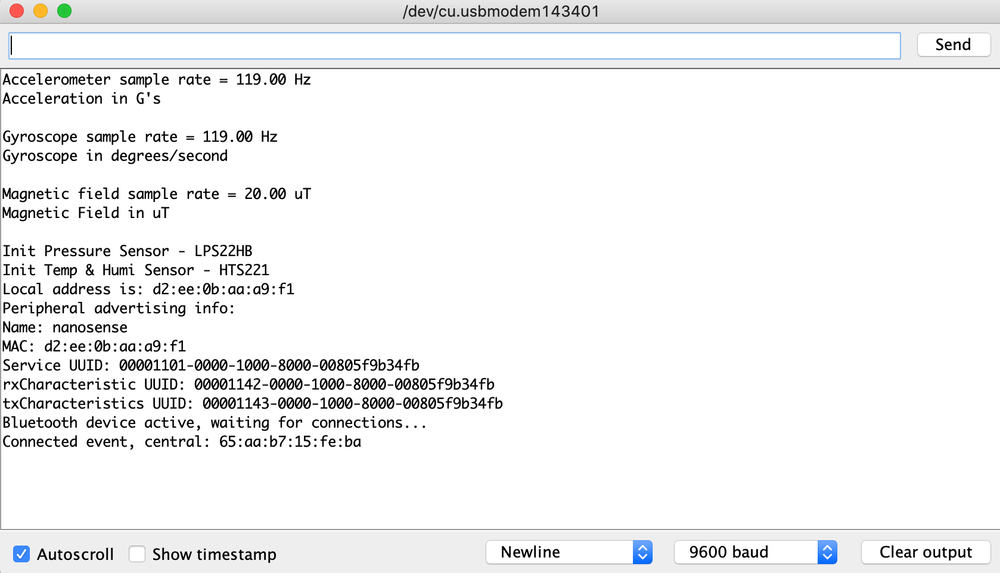

9.The Arduino Nano 33 will start reading the sensors and start sending the data to the iPhone app. 

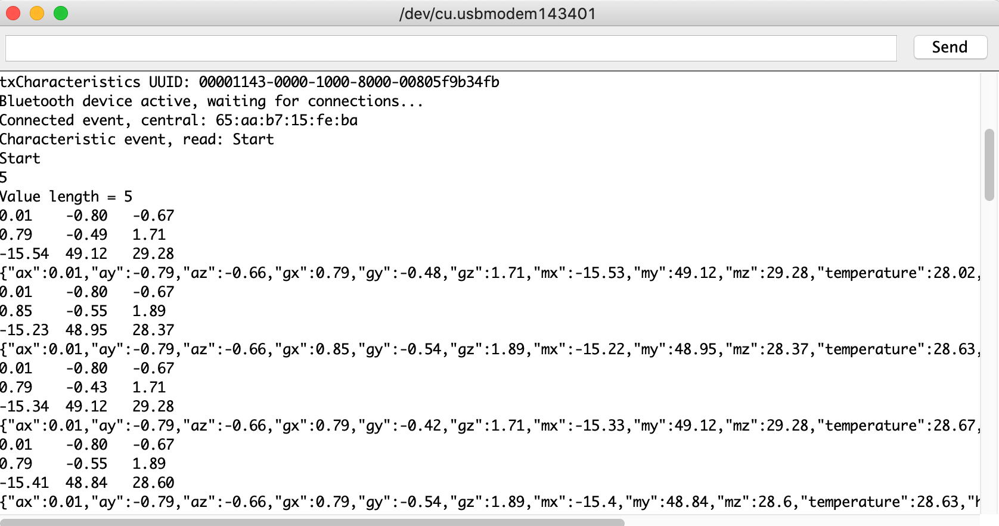
